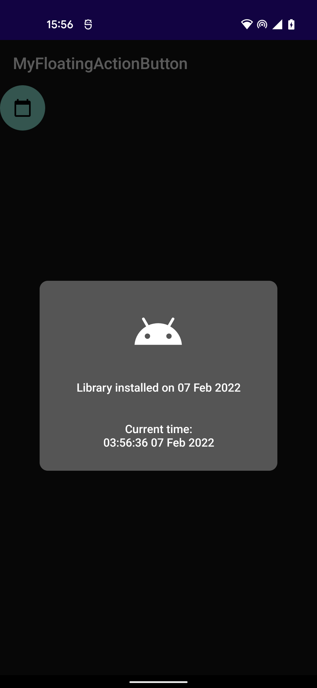
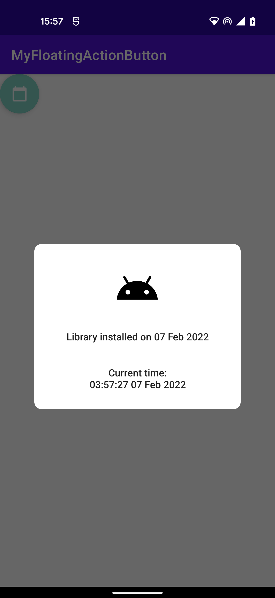

# Custom Fab (Documentation)

### Screenshots
 

## Prerequisites
- Android min sdk 21 (Android 5.0)
- Java 11 (to run tests from command line)

## Getting Started
Clone the repo with `git clone git@github.com:TobiAlbert/MyFloatingActionButton.git`

### Configuration
Use Android studio to manually import the `customfab` android library module as a dependency in your `build.gradle` file.

You should have something like this after importing the project.
```
dependencies {
  implementation project(':customfab')
}
```

### Add Class to `Activity` or `Fragment` `class`

```kotlin
	CustomFab(this)
```

## Development
The project contains both unit and instrumentation tests.

- Use `./gradlew customfab:test` to run unit tests on your local host
- User `./gradlew customfab:cAT` ro run instrumentation tests on an emulator or physical device.
